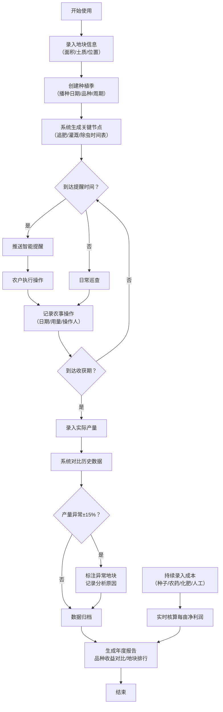

## 1. 产品概述

智慧农场种植记录与管理系统，为农户提供全方位的数字化种植管理解决方案。系统覆盖从地块规划、种植全周期记录、智能提醒到产量分析与收益核算的完整业务链条，帮助农户科学管理农田、提升产量、降低成本。

- **目标用户**：种植农户、家庭农场主、农业合作社管理者
- **核心价值**：通过数据化管理实现种植过程可追溯、产量可对比、成本可核算、收益可预测

## 2. 核心功能

### 2.1 用户角色

| 角色 | 注册方式 | 核心权限 |
|------|----------|----------|
| 农场主/农户 | 本地账号初始化 | 全部功能：地块管理、种植记录、成本核算、报告分析 |

### 2.2 功能模块

1. **首页仪表板**：数据概览卡片、待办提醒、关键节点预警、快捷操作入口
2. **地块管理**：地块信息录入、列表展示、地图位置标记、土质与面积详情
3. **种植季管理**：创建种植季、播种信息登记、生长周期追踪、关键节点设置
4. **农事操作日志**：施肥/打药/灌溉/除草记录、操作人与用量详情、操作时间线
5. **智能提醒中心**：生长周期节点提醒、农事待办推送、逾期操作警示
6. **收成管理**：产量录入、历史产量对比、异常产量标注、原因分析记录
7. **成本与收益**：分类成本录入（种子/农药/化肥/人工）、每亩成本核算、净利润计算
8. **分析报告**：品种年度收益对比、地块产量趋势图、投入产出比分析
9. **气象信息**：温度/降雨数据展示、气象与农事操作关联分析、异常天气预警

### 2.3 页面详情

| 页面名称 | 模块名称 | 功能描述 |
|----------|----------|----------|
| 首页仪表板 | 数据概览卡片 | 显示地块总数、种植中季数、本月操作次数、预估总收益 |
| 首页仪表板 | 待办提醒列表 | 列出即将到达的关键节点操作、逾期未完成操作 |
| 首页仪表板 | 快捷操作区 | 快速新增地块、快速记录操作、快速录入产量 |
| 首页仪表板 | 产量趋势图 | 近12个月各品种产量折线图 |
| 地块管理 | 地块列表 | 卡片式展示所有地块，含面积、土质、当前作物状态标签 |
| 地块管理 | 新增/编辑地块 | 表单录入地块名称、面积(亩)、土质类型、位置描述、备注 |
| 地块管理 | 地块详情 | 展示该地块所有种植季历史、累计产量、平均收益 |
| 种植季管理 | 种植季列表 | 按地块分组展示种植季，状态标签（育苗中/生长中/已收获） |
| 种植季管理 | 创建种植季 | 选择地块、录入播种日期、选择作物品种、设置预计收获期 |
| 种植季管理 | 生长周期节点 | 自动生成关键节点时间表（追肥/灌溉/除虫等） |
| 农事操作日志 | 操作时间线 | 按时间倒序展示所有农事操作，类型图标区分 |
| 农事操作日志 | 新增操作记录 | 选择种植季、操作类型、日期、用量、操作人、备注 |
| 智能提醒中心 | 提醒列表 | 按紧急程度排序，显示操作类型、所属地块、建议日期 |
| 智能提醒中心 | 提醒设置 | 自定义各作物品种的关键节点间隔天数 |
| 收成管理 | 收录入口 | 选择种植季、录入实际产量、收获日期、品质等级 |
| 收成管理 | 产量对比 | 同比/环比柱状图，标注异常偏差（±15%以上） |
| 收成管理 | 异常分析 | 异常地块标注、下拉选择原因类型、填写分析备注 |
| 成本与收益 | 成本录入 | 分类别录入：种子费、农药费、化肥费、人工费、其他 |
| 成本与收益 | 收益核算 | 自动计算总成本、每亩成本、总产值、每亩净利润 |
| 分析报告 | 品种收益对比 | 柱状图对比各作物品种的平均亩产、亩均收益 |
| 分析报告 | 地块效益排行 | 表格展示地块排名，含累计产量、投入、产出、净利润 |
| 气象信息 | 气象数据展示 | 近7天气温曲线、降雨量柱状图 |
| 气象信息 | 关联分析 | 显示降雨后3天内的农事操作记录，分析气象影响 |

## 3. 核心流程

### 3.1 主要业务流程描述

农户首次使用系统时，从"录入地块信息"开始，然后为每个地块创建种植季（录入播种信息和作物品种）。系统根据作物品种自动生成生长周期关键节点提醒。在种植过程中，农户随时记录施肥、打药、灌溉等农事操作。到达关键节点时系统发出提醒，农户完成操作后确认并记录。收获时录入实际产量，系统自动与历史数据对比并标注异常。农户在种植过程中持续录入各项成本，系统实时核算每亩净利润。最后通过分析报告查看各品种收益对比和地块效益排行。

### 3.2 Mermaid 流程图

## 4. 用户界面设计

### 4.1 设计风格

- **主色调**：自然田园绿 `#2D6A4F` 作为主色，搭配麦田金 `#D4A373` 作为辅助色，土壤棕 `#774936` 作为强调色
- **背景基调**：采用柔和的米白色 `#FAF8F5` 搭配微妙的有机纹理，营造自然、专业的农业科技感
- **按钮风格**：圆角矩形（8px圆角），主按钮绿色渐变填充，次要按钮白色底+绿色描边
- **字体选择**：
  - 标题字体：LXGW WenKai / 霞鹜文楷，兼具人文气息与可读性
  - 正文字体：Microsoft YaHei UI / PingFang SC，清晰易读
  - 数据字体：JetBrains Mono，数字对齐美观
- **布局风格**：左侧导航栏 + 右侧内容区的经典布局，内容区采用卡片式网格化设计
- **图标风格**：使用简洁的线性图标配合自然元素（叶子、麦穗、水滴）emoji点缀
- **交互细节**：卡片悬停微上浮+阴影加深，数据图表进场动画采用从下往上渐显

### 4.2 页面设计概览

| 页面名称 | 模块名称 | UI元素 |
|----------|----------|--------|
| 首页仪表板 | 数据概览卡片 | 4张彩色渐变卡片，大号数字+图标+同比变化百分比，数字滚动动画 |
| 首页仪表板 | 待办提醒列表 | 左侧紧急程度色条，右侧操作按钮，逾期红色警示闪烁 |
| 首页仪表板 | 产量趋势图 | SVG折线图，渐变填充区域，hover显示详情气泡 |
| 地块管理 | 地块列表 | 卡片网格布局，顶部地块名称+状态标签，中间面积土质信息，底部操作按钮 |
| 地块管理 | 新增地块表单 | 分组字段卡片，土质下拉选择含图标，位置输入框支持地图选点模拟 |
| 种植季管理 | 时间线视图 | 垂直时间线，节点用作物图标区分，连接线条采用渐变绿色 |
| 农事操作日志 | 操作时间线 | 左右交替布局，操作类型彩色气泡，操作人头像圆形展示 |
| 成本与收益 | 数据看板 | 大号金额数字，成本结构环形图，收益进度条 |
| 分析报告 | 对比图表 | 多色柱状图，X轴品种名称，Y轴双刻度（产量/收益） |
| 气象信息 | 气象卡片 | 温度曲线+降雨柱状组合图，天气状态emoji展示 |

### 4.3 响应式设计

- 采用桌面优先设计，主断点为 1440px / 1024px / 768px / 480px
- 屏幕宽度 < 1024px：左侧导航栏折叠为图标栏，卡片减少每行数量
- 屏幕宽度 < 768px：导航转为顶部汉堡菜单，卡片单列布局，表格转为列表卡片
- 所有触控目标尺寸 ≥ 44×44px，移动端增加表单输入框高度

### 4.4 数据可视化设计

- 所有图表采用 SVG + CSS 自绘方案，不依赖重型图表库
- 颜色语义化：绿色系代表产量/收益，棕色系代表成本，红色系代表异常/警示
- 数据标签位置合理，避免遮挡，hover状态显示精确数值
- 动画过渡：图表加载时采用逐段绘制动画（stroke-dasharray）
