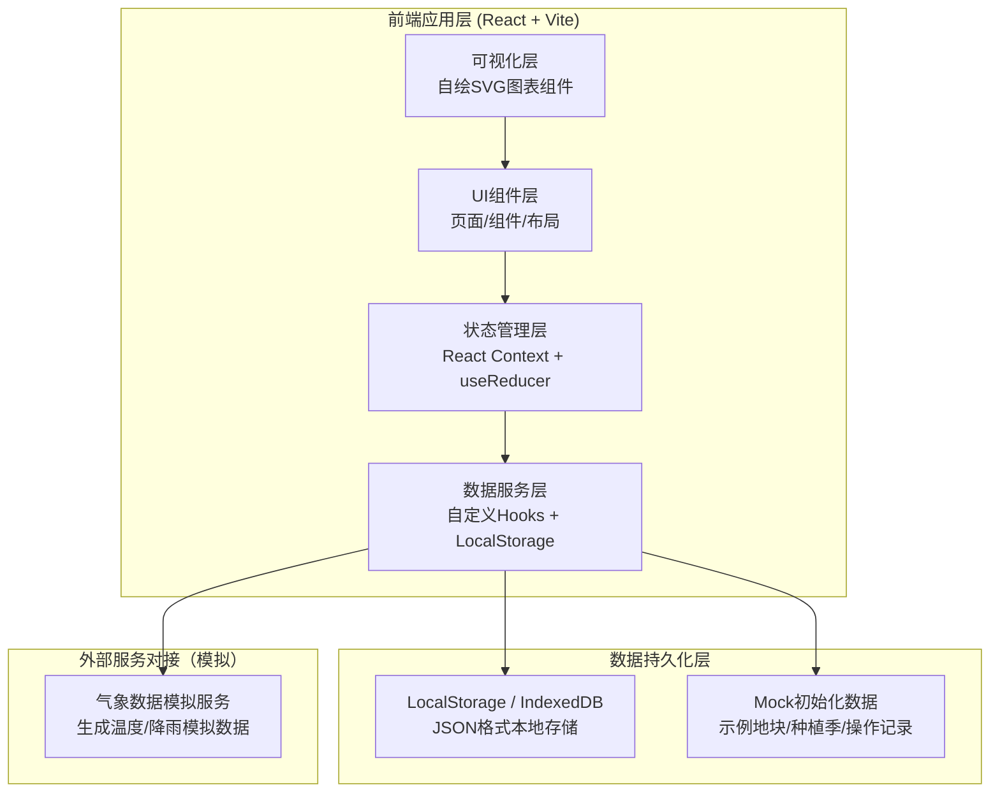
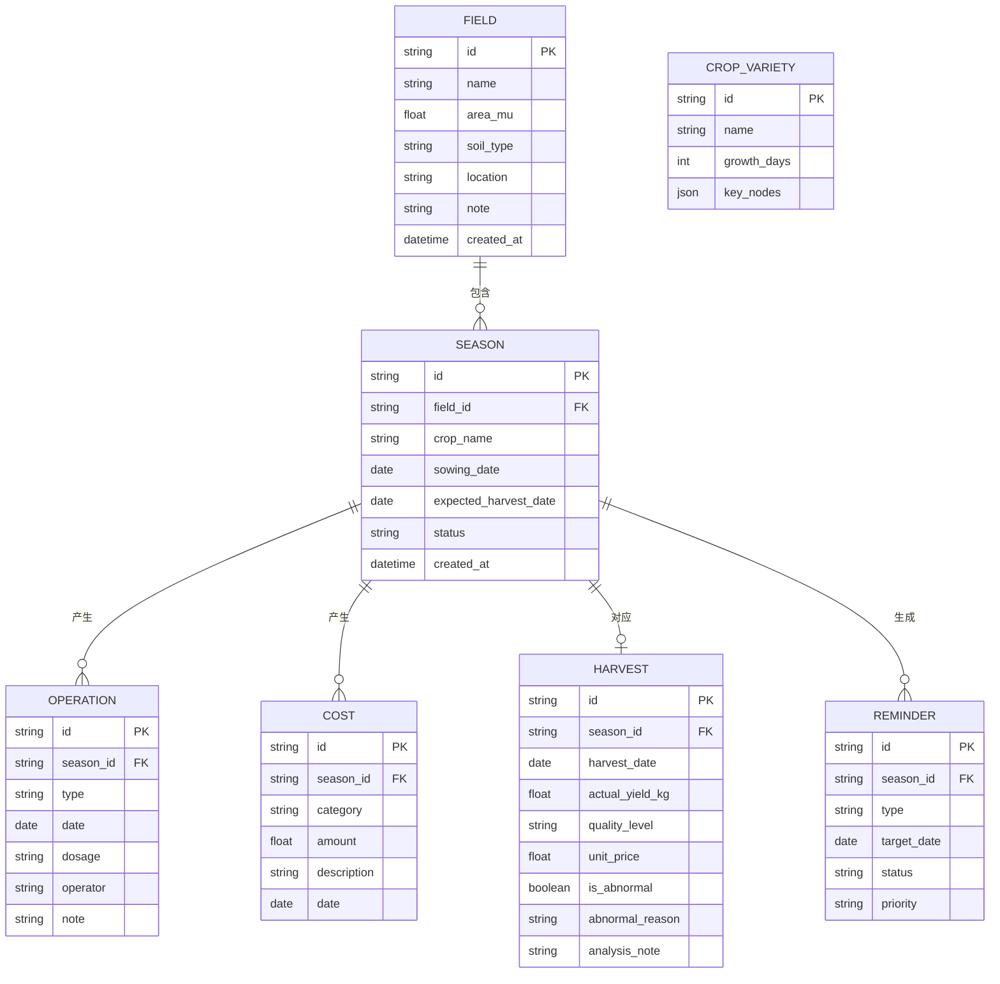

## 1. 架构设计



## 2. 技术描述

- **前端框架**：React 18 + TypeScript + Vite 5
- **样式方案**：TailwindCSS 3 + CSS Variables 主题系统
- **路由管理**：React Router DOM 6（Hash路由，适配静态部署）
- **状态管理**：React Context + useReducer（轻量级全局状态）
- **图标库**：Lucide React（简洁线性图标，匹配自然风格）
- **数据持久化**：LocalStorage 封装层 + 自定义序列化工具
- **图表方案**：自封装SVG图表组件（折线图/柱状图/环形图），不引入第三方图表库
- **日期处理**：date-fns（轻量日期计算库）
- **后端服务**：无后端，纯前端SPA应用，数据存储于浏览器本地
- **数据库**：LocalStorage（主存储）+ 预置Mock数据（首次加载初始化）

## 3. 路由定义

| 路由路径 | 页面名称 | 主要功能 |
|----------|----------|----------|
| `/` | 首页仪表板 | 数据概览、待办提醒、快捷操作、产量趋势 |
| `/fields` | 地块管理 | 地块列表、新增/编辑地块、地块详情 |
| `/seasons` | 种植季管理 | 种植季列表、创建种植季、生长周期追踪 |
| `/operations` | 农事操作日志 | 操作时间线、新增操作记录、操作筛选 |
| `/reminders` | 智能提醒中心 | 待办提醒列表、提醒设置、逾期警示 |
| `/harvest` | 收成管理 | 产量录入、历史对比、异常分析 |
| `/finance` | 成本与收益 | 成本录入、收益核算、利润计算 |
| `/reports` | 分析报告 | 品种收益对比、地块效益排行、投入产出分析 |
| `/weather` | 气象信息 | 气象数据展示、气象与农事关联分析 |

## 4. 数据模型

### 4.1 ER图



### 4.2 核心数据类型定义（TypeScript）

```typescript
// 土质类型
type SoilType = 'sandy' | 'loam' | 'clay' | 'silty' | 'peaty' | 'saline';

// 地块信息
interface Field {
  id: string;
  name: string;
  areaMu: number;
  soilType: SoilType;
  location: string;
  note?: string;
  createdAt: string;
}

// 种植季状态
type SeasonStatus = 'seeding' | 'growing' | 'harvested';

// 种植季信息
interface Season {
  id: string;
  fieldId: string;
  cropName: string;
  sowingDate: string;
  expectedHarvestDate: string;
  status: SeasonStatus;
  createdAt: string;
}

// 操作类型
type OperationType = 'fertilize' | 'pesticide' | 'irrigate' | 'weed' | 'prune' | 'other';

// 农事操作记录
interface Operation {
  id: string;
  seasonId: string;
  type: OperationType;
  date: string;
  dosage: string;
  operator: string;
  note?: string;
}

// 成本类别
type CostCategory = 'seed' | 'pesticide' | 'fertilizer' | 'labor' | 'other';

// 成本记录
interface Cost {
  id: string;
  seasonId: string;
  category: CostCategory;
  amount: number;
  description: string;
  date: string;
}

// 收成记录
interface Harvest {
  id: string;
  seasonId: string;
  harvestDate: string;
  actualYieldKg: number;
  qualityLevel: 'excellent' | 'good' | 'normal' | 'poor';
  unitPrice: number;
  isAbnormal: boolean;
  abnormalReason?: string;
  analysisNote?: string;
}

// 提醒优先级
type ReminderPriority = 'high' | 'medium' | 'low';

// 提醒状态
type ReminderStatus = 'pending' | 'completed' | 'overdue';

// 智能提醒
interface Reminder {
  id: string;
  seasonId: string;
  type: string;
  targetDate: string;
  status: ReminderStatus;
  priority: ReminderPriority;
}

// 气象数据
interface WeatherData {
  date: string;
  temperatureMax: number;
  temperatureMin: number;
  rainfall: number;
  weatherType: 'sunny' | 'cloudy' | 'rainy' | 'stormy';
}

// 作物品种及其生长周期配置
interface CropVariety {
  name: string;
  growthDays: number;
  keyNodes: Array<{
    name: string;
    daysAfterSowing: number;
    operationType: OperationType;
    priority: ReminderPriority;
  }>;
}
```

## 5. 关键模块设计

### 5.1 全局状态管理结构

```typescript
// 全局状态
interface AppState {
  fields: Field[];
  seasons: Season[];
  operations: Operation[];
  costs: Cost[];
  harvests: Harvest[];
  reminders: Reminder[];
  weather: WeatherData[];
  ui: {
    activeNav: string;
    modalStack: string[];
    toast: ToastMessage | null;
  };
}
```

### 5.2 核心业务逻辑模块

| 模块名称 | 主要职责 | 关键函数 |
|----------|----------|----------|
| `seasonService` | 种植季业务逻辑 | createSeason / updateSeasonStatus / generateKeyNodes |
| `reminderService` | 提醒生成与管理 | generateReminders / checkOverdue / markCompleted |
| `financeService` | 成本与收益核算 | calculateSeasonCost / calculateProfit / calculatePerMuMetrics |
| `reportService` | 报告与分析 | compareCropVarieties / rankFieldEfficiency / detectYieldAbnormal |
| `weatherService` | 气象数据处理 | generateMockWeather / correlateOperationsWithWeather |
| `storageService` | 本地持久化 | saveState / loadState / migrateDataSchema |

### 6. 预置Mock数据说明

为保证用户首次使用即可体验完整功能，系统预置以下数据：
- 3-5个示例地块（不同面积、土质、位置）
- 6-8个种植季（包含不同作物、不同状态：育苗中/生长中/已收获）
- 20-30条农事操作记录
- 10-15条成本记录
- 3-5个已完成的收成记录
- 近7天气象模拟数据
- 5-8条待办提醒（含部分逾期警示）
- 支持的作物品种配置（小麦、玉米、水稻、大豆、番茄、黄瓜等）
